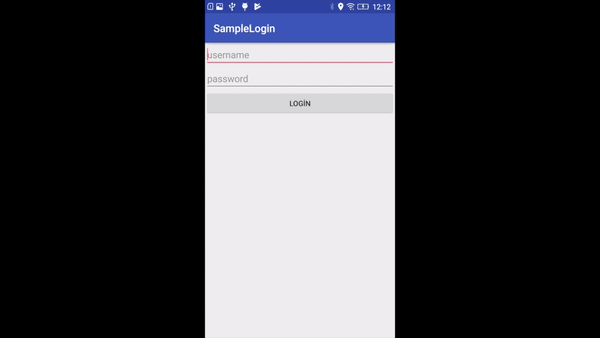

# Introduction
Before cloning or review the repositoy, please study on Appium Getting Started documentation.(https://appium.io/docs/en/about-appium/getting-started/?lang=en)
If you follow the documentation, you can understand easly implementation which is stored in this repository. 

# Android Application
It is a toy example to test. Beginners can understand the application implementation easly.
It includes only one page that has login UI components such as Button, EditText and TextView.

# Test Scripts
There three different scripts which are config.js, fail_login_test.js and success_login_test.js.
Config file has only one configuration object which represents configuration settings about application and device. Please read the documentation. (https://appium.io/docs/en/about-appium/getting-started/?lang=en)
success_login_test.js represents our positive test with valid login credentials, of course, these cridentials are simple to be more clear to understand UI test automation easly.
fail_login_test.js includes our negative test with invalid login credentials.

# Test Execution

# Test Output on Server

# Application Under Test on Real Device

